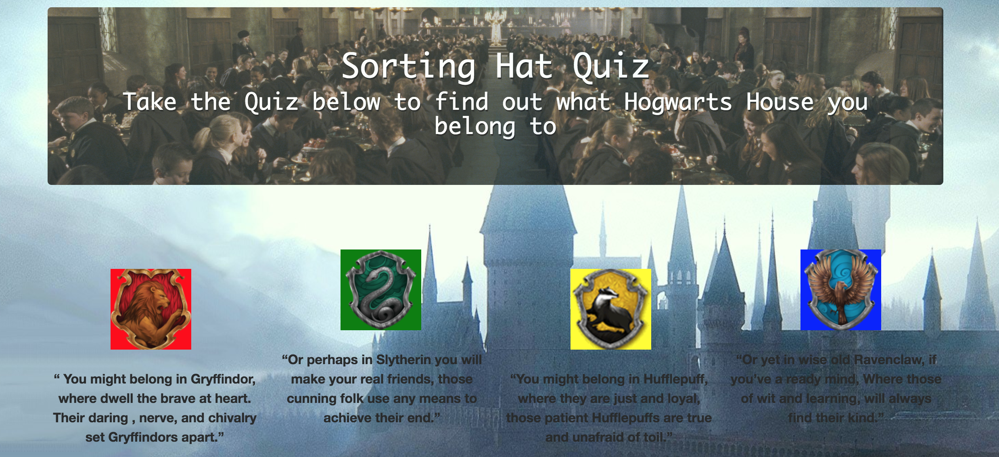
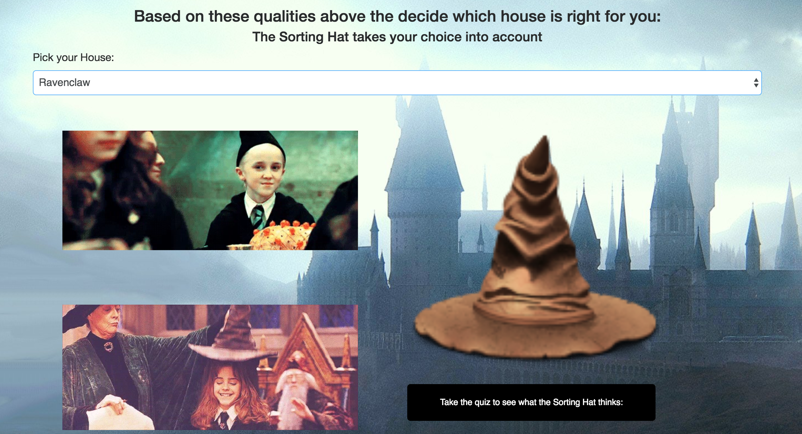
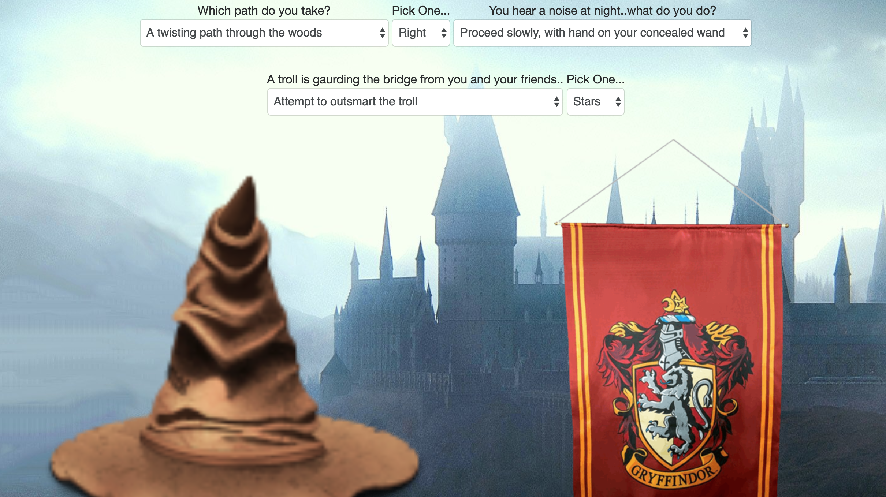

## Author
  * Kaila Goff 1.27.18

# Sorting Hat

A webpage that lets the user find out which Harry Potter House they belong to. User inputs their choice for a house, and then answer a five question quiz. The combination of those two results will sort the user into the house that most closely matches their input.

<kbd></kbd>

<kbd></kbd>

<kbd></kbd>

## Built With
  * HTML
  * Javascript
  * jQuery
  * Bootstrap

## Links
  * _<a href="https://kailagoff.github.io/sorting-hat/">Sorting Hat</a>_

## Download
  * Clone from Github
  * Open index.html in web browser

### Bugs
  * No known bugs at this time

## License
This product is written under the MIT license
Copyright 2018
